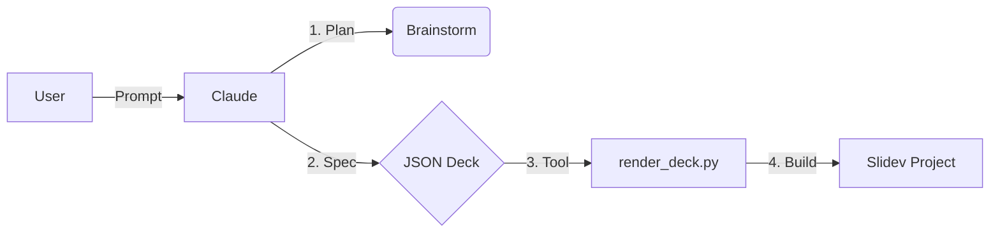

# Claude Skills: Presentation You

> A meta-demonstration of "Agentic Skills" for Claude Desktop.

This repository allows **Claude** to autonomously author, build, and polish professional [Slidev](https://sli.dev) presentations using a deterministic "Chef vs. Waiter" workflow.

## 🎯 What is this?

This is a **Claude Desktop Skill** (MCP Server) that gives Claude "hands" to build slides.

Instead of just *chatting* about a presentation, Claude uses this skill to:
1.  **Plan**: Brainstorm structure and tone.
2.  **Generate**: Create strict JSON specifications (`deck.json`).
3.  **Render**: Deterministically compile valid Vue/Markdown slides.
4.  **Polish**: Apply themes, animations, and custom components.

## 📂 Repository Structure

*   **`.claude/skills/authoring-slidev-decks/`**: The Skill definition, scripts, and MCP manifest.
*   **`claude-skills-presentation/`**: A complete example output generated by the skill.
    *   Includes custom `AnimatedBg.vue` component.
    *   Showcases "Northern Lights" theme and glassmorphism.

## 🚀 Getting Started

### Prerequisites
*   Python 3.10+
*   Node.js & NPM
*   Claude Desktop App

### Installation

1.  Clone this repository.
2.  Add the skill to your Claude Desktop configuration (via `manifest.json`).

### Usage

Ask Claude:
> "Help me build a Slidev presentation about [Topic]."

Claude will guide you through the **Brainstorming** phase before executing the build commands.

## 🛠️ The Workflow

## 📄 License

MIT
