# Under the Hood

Safe and deterministic.

```mermaid
graph TD
    U[👤 User] -->|Prompt| A[🤖 Agent]
    A -->|Spec| J{JSON}
    J -->|Pass| T[🛡️ Tools]
    J -->|Fail| A
    T -->|Validation| T
    T -->|Render| S[✨ Slides]
```

::right::

  <StepList :steps="[
    {title: 'Plan', desc: 'Brainstorm structure first'},
    {title: 'Generate', desc: 'Create pure JSON specifications'},
    {title: 'Render', desc: 'Python scripts build the files'}
  ]" />

